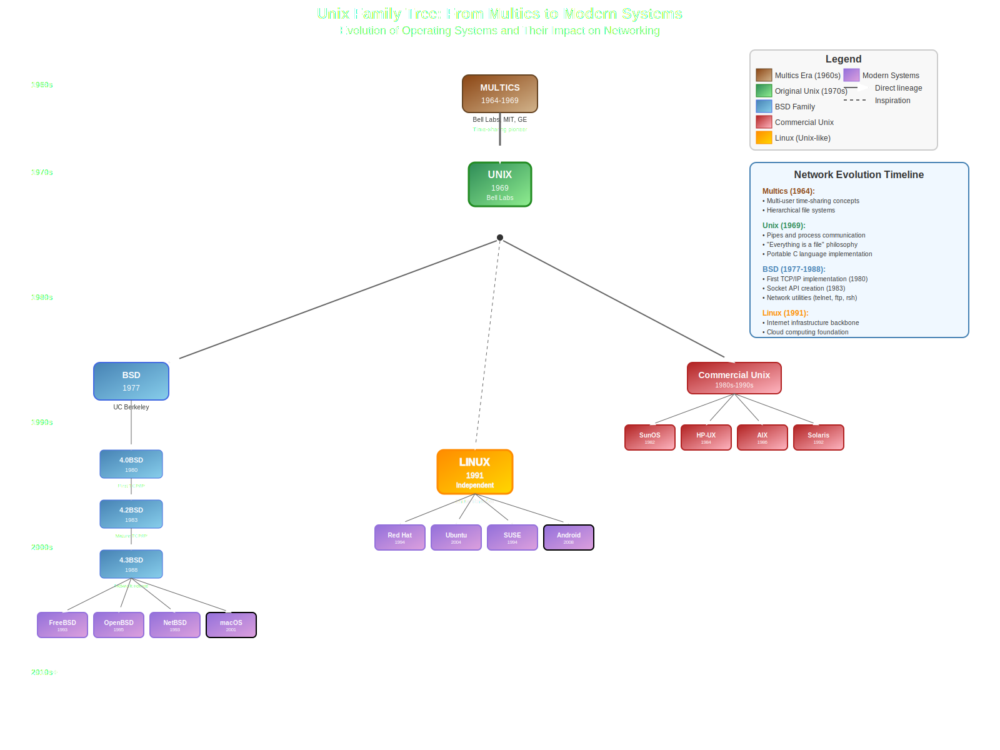

# Unix: The Foundation of Modern Networking

Unix stands as one of the most influential operating systems in computing history, fundamentally shaping how networks operate today. Understanding Unix is crucial for anyone working with networks, as its design principles and tools form the backbone of the internet and modern networking infrastructure.



## The Birth of Unix (1969-1973)

### The Multics Legacy

Before Unix, there was **Multics** (Multiplexed Information and Computing Service), an ambitious project started in 1964 by Bell Labs, MIT, and General Electric. Multics aimed to create a revolutionary time-sharing system that could support hundreds of users simultaneously.

**Key Multics Innovations:**
- **Hierarchical file system** (directories within directories)
- **Dynamic linking** of programs
- **Multi-level security** with access controls
- **Virtual memory** management

However, Multics became overly complex and expensive. Bell Labs withdrew from the project in 1969, leaving behind valuable ideas but no practical system.

### Ken Thompson's Creative Summer (1969)

**Ken Thompson**, working at Bell Labs, found himself with access to an unused PDP-7 minicomputer during the summer of 1969. Missing the computing environment he'd grown accustomed to with Multics, Thompson decided to create something simpler.

**The First Unix (originally "Unics"):**
- **September 1969:** Thompson wrote the first Unix kernel
- **"Unics"** was a pun on "Multics" - UNIplexed Information and Computing Service
- **Goal:** Create a simple, elegant system that could support multiple users
- **Philosophy:** "Do one thing and do it well"

### The C Language Revolution (1972)

**Dennis Ritchie** joined Thompson in developing Unix and created the **C programming language** specifically for Unix development. This was revolutionary because:

**Before C:**
- Operating systems were written in assembly language
- Each system was tied to specific hardware
- Porting to new machines required complete rewrites

**With C:**
- Unix became **portable** across different computer architectures
- **1973:** Unix was rewritten entirely in C
- **Result:** Same operating system could run on various hardware platforms

## Unix's Networking DNA

### Built-in Networking Philosophy

Unix was designed from the ground up with networking in mind, embedding principles that would later become fundamental to internet protocols:

#### 1. **Everything is a File**
```bash
# Network connections appear as files
ls /proc/net/
# Shows: tcp, udp, route, arp, dev, etc.

# Network devices are files
ls /dev/ | grep -E "(eth|wlan|tun)"
# Shows: eth0, wlan0, tun0, etc.
```

This abstraction made network programming consistent and intuitive.

#### 2. **Pipes and Redirection**
```bash
# Network data flows like water through pipes
netstat -an | grep :80 | wc -l
# Chain commands together for complex network analysis
```

The pipe concept (`|`) influenced how network protocols pass data between layers.

#### 3. **Small, Composable Tools**
Instead of monolithic applications, Unix provided small tools that worked together:
```bash
# Network troubleshooting with composable tools
ping -c 1 google.com | grep "time=" | cut -d'=' -f4
netstat -rn | grep default | awk '{print $2}'
ss -tuln | grep :22
```

### The TCP/IP Birth on Unix

**1973-1983:** The development of TCP/IP happened primarily on Unix systems:

- **1973:** Vint Cerf and Bob Kahn start developing TCP/IP protocols
- **1975:** First TCP/IP implementation written for Unix
- **1983:** ARPANET officially adopts TCP/IP as standard protocol
- **1983:** Unix systems become the backbone of early internet infrastructure

**Why Unix was perfect for TCP/IP:**
- **Process model:** Each network connection could be a separate process
- **Inter-process communication:** Built-in mechanisms for processes to communicate
- **File descriptors:** Network sockets treated like files (read/write operations)
- **Multitasking:** Could handle multiple network connections simultaneously

## Unix Predecessors and Evolution

### The Computing Landscape Before Unix

#### Batch Processing Systems (1950s-1960s)
- **Single user** at a time
- **No interactive computing**
- Submit job, wait hours/days for results
- **Examples:** IBM 7090, UNIVAC I

#### Time-Sharing Systems (1960s)
- **Multiple users** sharing one computer
- **Interactive terminals** allowed real-time interaction
- **Examples:** MIT's CTSS (1961), Dartmouth's DTSS (1964)

#### Problems with Early Systems:
- **Hardware-specific:** Each system tied to particular machines
- **Limited file systems:** Flat or simple hierarchical structures
- **Proprietary interfaces:** No standard way to write programs
- **Network limitations:** Systems couldn't communicate effectively

### The Unix Family Tree

```
1969: Unix (Bell Labs)
├── 1977: BSD (Berkeley Software Distribution)
│   ├── 1980: 4.0BSD (includes TCP/IP)
│   ├── 1983: 4.2BSD (mature TCP/IP stack)
│   ├── 1988: 4.3BSD
│   └── Modern: FreeBSD, OpenBSD, NetBSD, macOS
├── 1982: SunOS (later Solaris)
├── 1984: HP-UX
├── 1986: AIX (IBM)
└── 1991: Linux (Unix-like, independent kernel)
    └── Modern: Ubuntu, RedHat, SUSE, Android
```

### Berkeley Software Distribution (BSD) - The Networking Pioneer

**1977:** University of California, Berkeley, received Unix source code from Bell Labs. Graduate student **Bill Joy** began enhancing Unix, creating BSD.

**BSD's Networking Contributions:**
- **1980:** First TCP/IP implementation for Unix
- **1983:** 4.2BSD included mature TCP/IP stack
- **Socket API:** Created the standard way programs communicate over networks
- **Network utilities:** telnet, ftp, rsh, rcp

```c
// The revolutionary socket API (still used today!)
int socket(int domain, int type, int protocol);
int bind(int sockfd, const struct sockaddr *addr, socklen_t addrlen);
int listen(int sockfd, int backlog);
int accept(int sockfd, struct sockaddr *addr, socklen_t *addrlen);
```

## Unix's Revolutionary Impact on Networking

### 1. **Standardized Network Programming**

**Before Unix:**
- Each system had proprietary networking APIs
- Network programs couldn't be shared between systems
- Limited interoperability

**With Unix:**
- **Socket API** became universal standard
- Programs portable across Unix systems
- Foundation for internet applications

### 2. **The Internet Protocol Suite**

Unix systems became the testbed for internet protocols:
- **SMTP** (email) - first implemented on Unix
- **HTTP** (web) - Tim Berners-Lee developed on NeXT (Unix-based)
- **DNS** (domain names) - BIND first ran on Unix
- **SSH** (secure remote access) - developed for Unix systems

### 3. **Server Infrastructure**

Unix became synonymous with servers because of:
- **Reliability:** Systems could run for years without rebooting
- **Security model:** User permissions and process isolation
- **Networking capabilities:** Built-in TCP/IP support
- **Remote administration:** SSH and other remote management tools

### 4. **Development Culture**

Unix fostered a development culture that shaped networking:
- **Open source collaboration:** BSD license encouraged sharing
- **Documentation standards:** Man pages (`man ssh`, `man tcp`)
- **Tool composition:** Building complex solutions from simple parts
- **Standards compliance:** Following RFC specifications

## Unix Principles That Shaped Modern Networks

### 1. **Modularity**
```bash
# Network services as separate processes
systemctl status sshd    # SSH daemon
systemctl status httpd   # Web server
systemctl status named   # DNS server
```

Each network service runs independently, making systems more reliable and maintainable.

### 2. **Text-Based Configuration**
```bash
# Network configuration in plain text files
/etc/hosts           # Static host names
/etc/resolv.conf     # DNS configuration
/etc/ssh/sshd_config # SSH server configuration
/etc/network/interfaces  # Network interface configuration
```

This approach made configuration scriptable, versionable, and debuggable.

### 3. **Process Communication**
Unix's inter-process communication mechanisms influenced network protocols:
- **Pipes** → Data streaming in network protocols
- **Signals** → Network event handling
- **Shared memory** → High-performance network applications

### 4. **Security Model**
```bash
# Unix permissions model influenced network security
chmod 600 ~/.ssh/id_rsa     # Private key permissions
chown root:root /etc/shadow  # System file ownership
sudo iptables -L            # Firewall rules (privilege separation)
```

## Modern Unix Influence on Networking

### Cloud Computing
- **Linux** (Unix-like) powers most cloud infrastructure
- **Container technology** (Docker) built on Unix process model
- **Kubernetes** orchestration based on Unix principles

### Network Operating Systems
- **Cisco IOS** - Unix-based network device operating system
- **Juniper JUNOS** - FreeBSD-based router/switch OS
- **pfSense/OPNsense** - BSD-based firewall distributions

### Internet Infrastructure
- **Web servers:** Apache, Nginx (Unix/Linux)
- **DNS servers:** BIND (Berkeley Internet Name Domain)
- **Email servers:** Sendmail, Postfix (Unix heritage)
- **Database servers:** PostgreSQL, MySQL (Unix-first)

## Why Network Engineers Need Unix Knowledge

### 1. **Ubiquity**
- **Internet backbone:** Routers, switches run Unix-like systems
- **Cloud providers:** AWS, Google Cloud, Azure use Linux extensively
- **Network security:** Firewalls, IDS/IPS systems based on Unix
- **Monitoring tools:** Most network monitoring runs on Unix/Linux

### 2. **Troubleshooting Tools**
Essential Unix networking commands:
```bash
# Network connectivity
ping, traceroute, mtr

# Network configuration
ip, ifconfig, route, netstat, ss

# Network analysis
tcpdump, wireshark, nmap

# System analysis
ps, top, htop, lsof, strace

# Log analysis
grep, awk, sed, tail, journalctl
```

### 3. **Automation and Scripting**
```bash
#!/bin/bash
# Network monitoring script - quintessentially Unix
for host in web1 web2 db1; do
    if ping -c 1 "$host" >/dev/null 2>&1; then
        echo "$host: UP"
    else
        echo "$host: DOWN" | mail -s "Alert: $host down" admin@company.com
    fi
done
```

### 4. **Security Understanding**
Unix security concepts directly apply to network security:
- **User/group permissions** → Network access control
- **Process isolation** → Service security
- **Logging and auditing** → Network monitoring
- **Package management** → Security updates

## The Unix Philosophy and Network Design

### Core Principles

1. **"Do one thing and do it well"**
   - Network protocols have specific purposes (HTTP for web, SMTP for email)
   - Network tools are specialized (ping for connectivity, traceroute for path analysis)

2. **"Everything is a file"**
   - Network connections appear as file descriptors
   - Configuration stored in text files
   - Network devices appear in /dev/ filesystem

3. **"Write programs to work together"**
   - Network protocols are layered and interoperable
   - Tools can be combined (pipes, redirection)
   - APIs allow programs to communicate

4. **"Choose portability over efficiency"**
   - Network protocols work across different systems
   - Standards ensure interoperability
   - TCP/IP runs on everything from embedded devices to supercomputers

## Conclusion: Unix's Lasting Network Legacy

Unix didn't just influence networking—it fundamentally created the paradigms we still use today:

**Technical Contributions:**
- Socket API (still the standard for network programming)
- TCP/IP implementation and testing platform
- Network troubleshooting and analysis tools
- Server operating system model

**Cultural Contributions:**
- Open collaboration on networking standards
- Documentation and knowledge sharing culture
- Tool composition and scripting approach
- Security-first design thinking

**Modern Relevance:**
Every time you use the internet, you're benefiting from Unix innovations:
- **Web browsing:** HTTP servers running on Unix-like systems
- **Email:** SMTP servers with Unix heritage
- **Cloud services:** Linux-based infrastructure
- **Mobile apps:** iOS (Unix-based) and Android (Linux-based)

Understanding Unix isn't just about learning an old operating system—it's about understanding the foundation of modern networking. The principles, tools, and approaches developed in Unix labs over 50 years ago continue to power our connected world today.

**For the modern network professional:** Unix knowledge provides the deep understanding needed to troubleshoot complex network issues, automate network tasks, and design robust, scalable network infrastructures.

---

*"Unix is not just an operating system, it's a way of thinking about how computers should work together."* - The Unix philosophy that built the internet